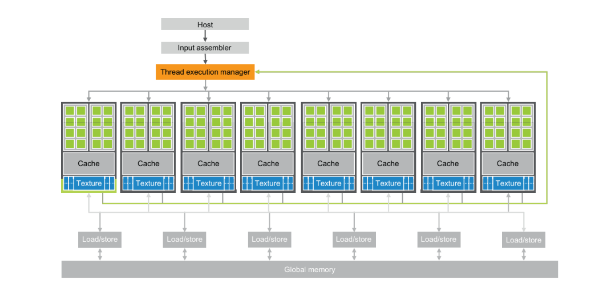
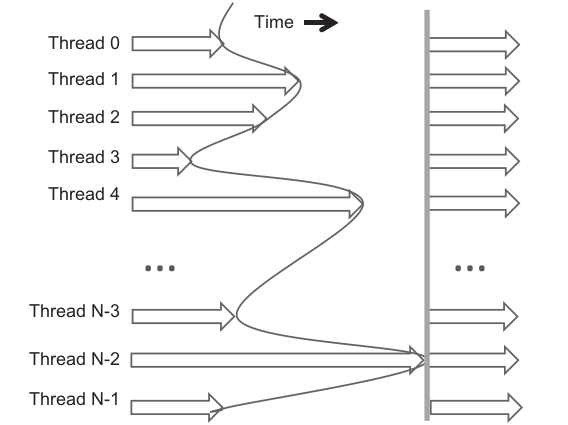
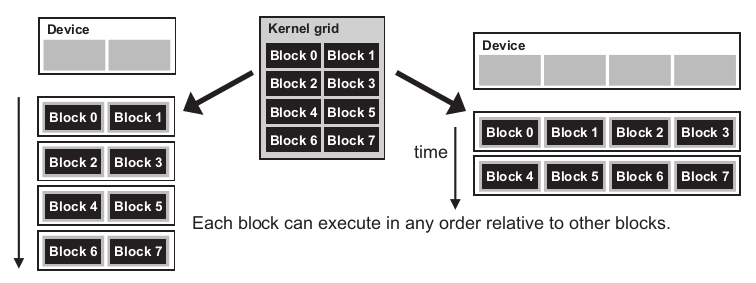
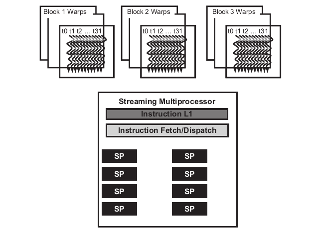

# 4. Compute Architecture and Scheduling
## 4.1 Architecture of a Modern GPU

A CUDA-cabable GPU is organized as an array of highly threaded streaming muliprocessors (SMs).

SMs form a building block. The number of SMs per building block can be different from one generation to another. Each SM has streaming processors (SPs) that share control logic and instruction cache.



Each GPU currently comes with gigabytes of Graphics Double Data Rate (GDDR), Synchronous DRAM (SDRAM), referred to as Global Memory.

GPUs global memory communicates with the system memory over PCI-E transferring 8-16GB/S in each direction. More recent GPUS support NVLINK a CPU-GPU and GPU-GPU interconnect that allows transfers of up to 40 GB/s per channel.

---

## 4.2 Block Scheduling

---

## 4.3 Synchronization and Transparent Scalability
CUDA allows threads in the same block to coordinate their activities by using a barrier synchronization function *__syncthreads()*. When a thread calls *__syncthreads()*, it will be held at the calling location until every thread in the block reaches the location. This process ensures that all threads in a block have completed a phase of their execution of the kernel before any of them can proceed to the next phase.



In CUDA, a *__syncthreads()* statement, if present, must be executed by all threads in a block. 

When a __syncthread() statement is placed in an if-statement, either all or none of the threads in a block execute the path that includes the *__syncthreads()*. 

For an if-then-else statement, if each path has a *__syncthreads()* statement, either all threads in a block execute the then-path or all of them execute the else-path. The two *__syncthreads()* are different barrier synchronization points. If a thread in a block executes the then-path and another executes the else-path, they would be waiting at different barrier synchronization points. They would end up waiting for each other forever.

One needs to make sure that all threads involved in the barrier synchronization have access to the necessary resources to eventually arrive at the barrier. Otherwise, a thread that never arrives at the barrier synchronization point can cause everyone else to wait forever. CUDA runtime systems satisfy this constraint by assigning execution resources to all threads in a block as a unit. A block can begin execution only when the runtime system has secured all resources needed for all threads in the block to complete execution. When a thread of a block is assigned to an execution resource, all other threads in the same block are also assigned to the same resource. This condition ensures the temporal proximity of all threads in a block and prevents excessive or indefinite waiting time during barrier synchronization.

This leads us to an important tradeoff in the design of CUDA barrier synchronization. By not allowing threads in different blocks to perform barrier synchronization with each other, the CUDA runtime system can execute blocks in any order relative to each other because none of them need to wait for each other.

This allows us to run the same code on different hardware. The ability to execute the same application code on hardware with different numbers of execution resources is referred to as transparent scalability. This characteristic reduces the burden on application developers and improves the usability of applications.



---

## 4.4 Warps and SIMD Hardware

---

## 4.5 Control Divergence

---

## 4.6 Warp Scheduling and Latency Tolenrance
Thread scheduling is strictly an implementation concept. In the majority of implementations to date, a block assigned to an SM is further divided into 32 thread units called *warps*. 

The size of warps is implementation-specific. Warps are not part of the CUDA specification; however, knowledge of warps can be helpful in understanding and optimizing the performance of CUDA applications on particular generations of CUDA devices. The size of warps is a property of a CUDA device, which is in the warpSize field of the device query variable (*dev_prop* in this case).

The warp is the unit of thread scheduling in SMs. Fig. 3.13 shows the division of blocks into warps in an implementation. Each warp consists of 32 threads of consecutive threadIdx values. In this example, three blocks—Block 1, Block 2, and Block 3—are assigned to an SM. Each of the three blocks is further divided into warps for scheduling purposes.



An SM is designed to execute all threads in a warp following the Single Instruction, Multiple Data (SIMD) model—i.e., at any instant in time, one instruction is fetched and executed for all threads in the warp. These threads will apply the same instruction to different portions of the data. Consequently, all threads in a warp will always have the same execution timing.

In early GPU designs, each SM can execute only one instruction for a single warp at any given time. In recent designs, each SM can execute instructions for small number of warps at any point in time.

A legimitate question is why we need to have so many warps in an SM if it can only execute a small subset of them at any insant. The answer is that this is how CUDA processors efficiently execute long-latency operations, such as global memory accesses.

When an instruction to be executed by a warp needs to wait for the result of a previously initiated long-latency operation, the warp is not selected for execution. Instead, another resident warp that is no longer waiting for results will be selected for execution. If more than one warp is ready for execution, a priority mechanism is used to select one for execution. This mechanism of filling the latency time of operations with work from other threads is often called “latency tolerance” or “latency hiding”.

Warp scheduling is also used for tolerating other types of operation latencies, such as pipelined floating-point arithmetic and branch instructions. Given a sufficient number of warps, the hardware will likely find a warp to execute at any point in time, thus making full use of the execution hardware in spite of these long-latency operations. The selection of ready warps for execution avoids introducing idle or wasted time into the execution timeline, which is referred to as zero-overhead thread scheduling. With warp scheduling, the long waiting time of warp instructions is “hidden” by executing instructions from other warps. This ability to tolerate long-latency operations is the main reason GPUs do not dedicate nearly as much chip area to cache memories and branch prediction mechanisms as do CPUs. Thus, GPUs can dedicate more of its chip area to floating-point execution resources.

---

## 4.7 Resource Partioning and Occupancy
Once a kernel is launched, the CUDA runtime system generates the corresponding grid of threads. As discussed in the previous section, these threads are assigned to execution resources on a block-by-block basis. In the current generation of hardware, the execution resources are organized into Streaming Multiprocessors (SMs).

Each device sets a limit on the number of blocks that can be assigned to each SM. In situations where there is shortage of one or more types of resourcesmneeded for the simultaneous execution of blocks, the CUDA runtime automaticallymreduces the number of blocks assigned to each SM until their combined resourcemusage falls below the limit.

One of the SM resource limitations is the number of threads that can be simultaneously tracked and scheduled. It takes hardware resources (built-in registers) for SMs to maintain the thread and block indexes and track their execution status. Therefore, each generation of hardware sets a limit on the number of blocks and number of threads that can be assigned to an SM.

---

## 4.8 Querying Device Properties

Our discussions on assigning execution resources to blocks raise an important question. How do we find out the amount of resources available?

A system may or may not contain one or more CUDA capable devices. To get the number of devices, we can use the following code:

```C
int dev_count;
cudaGetDeviceCount(&dev_count);
```

The CUDA runtime numbers all available devices in the system from 0 to *dev_count*-1. It provides an API function *cudaGetDeviceProperties* that returns the properties of the device whose number is given as an argument. We can use the following statements in the host code to iterate through the available devices and query their properties:

```C
cudaDeviceProp dev_prop;
for (int i = 0; i < dev_count; i++) {
    cudaGetDeviceProperties(&dev_prop, i);
    //decide if device has sufficient resources and capabilities
}
```

The built-in type [*cudaDeviceProp*](https://docs.nvidia.com/cuda/cuda-runtime-api/structcudaDeviceProp.html) is a C struct type with fields representing the properties of a CUDA device.

---

## 4.9 Summary

---
