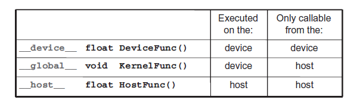
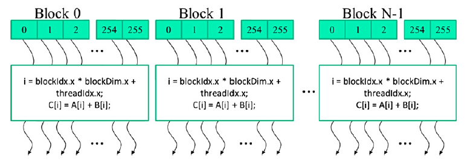
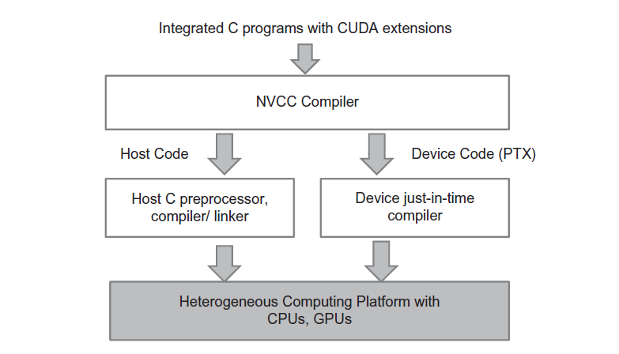

# 2. Data Parallel Computing

[TOC]

---

## 2.1 Function declarations


## 2.2 Kernel call and grid launch
An example of a grid is shown below:

A unique global index i is calculated as:
```C
i = blockIdx.x * blockDim.x + threadIdx.x
```

---

## 2.3 Built-in (predefined) variables
CUDA programming is an instance of the well-known Single-Program-Multiple-Data([SPMD](https://en.wikipedia.org/wiki/Single_program,_multiple_data)).

* threadIdx: thread index
* blockIdx: block index
* blockDim: number of threads in a block
* gridDim: number of blocks in a grid

```C
function_name<<<gridDim, blockDim>>>(...);
                    ^       ^
```

---

## 2.4 Data Transfer API
### 2.4.1 cudaMalloc(devPtr, size)
[Allocate memory on the device.](https://docs.nvidia.com/cuda/cuda-runtime-api/group__CUDART__MEMORY.html#group__CUDART__MEMORY_1g37d37965bfb4803b6d4e59ff26856356)
- devPtr: Address of a pointer to the allocated object. **The address of the pointer variable should be cast to (void \**)**
- size: Size of allocated object in terms of bytes

### 2.4.2 cudaFree(devPtr)
[Frees memory on the device.](https://docs.nvidia.com/cuda/cuda-runtime-api/group__CUDART__MEMORY.html#group__CUDART__MEMORY_1ga042655cbbf3408f01061652a075e094)
- devPtr: Pointer to freed object

### 2.4.3 cudaMemcpy(dst, src, count, kind)
[Copies data between host and device.](https://docs.nvidia.com/cuda/cuda-runtime-api/group__CUDART__MEMORY.html#group__CUDART__MEMORY_1gc263dbe6574220cc776b45438fc351e8)
- dst: Pointer to destination
- src: Pointer to source
- count: Number of bytes copied
- kind: [Type/Direction](https://docs.nvidia.com/cuda/cuda-runtime-api/group__CUDART__TYPES.html#group__CUDART__TYPES_1g18fa99055ee694244a270e4d5101e95b) of transfer

---

## 2.5 Compilation
Once device functions and data declarations are added to a source file the code needs to be compiled by a compiler that recognizes and understands these additional declarations. We will be using a CUDA C compiler called [NVCC](https://docs.nvidia.com/cuda/cuda-compiler-driver-nvcc/index.html) (NVIDIA C Compiler).

The NVCC compiler processes a CUDA C program, using the CUDA keywords to separate the host code and device code. 

- The host code is straight ANSI C code, which is further compiled with the host's standard C/C++ compilers and executed on a CPU device. 

- The device code is marked with CUDA keywords for data parallel functions, called kernels, and their associated helper functions and data structures. The device code is further compiled by a run-time component of NVCC and executed on a GPU device.



---

## 2.6 Example of Vector Addition

([full code](./labs/array_add_on_device)).

```C
// Compute vector sum C = A + B
// Each thread performs one pair-wise addition
__global__
void vecAddKernel(float* A, float* B, float* C, int n)
{
    int i = blockDim.x*blockIdx.x + threadIdx.x;
    if(i < n) C[i] = A[i] + B[i];
}

void vecAdd(float* A, float* B, float* C, int n)
{
    int size = n * sizeof(float);
    float *d_A *d_B, *d_C;
    
    cudaMalloc((void **) %d_A, size);
    cudaMemcpy(d_A, h_A, size, cudaMemcpyHostToDevice);
    cudaMalloc((void **) %d_B, size);
    cudaMemcpy(d_B, h_B, size, cudaMemcpyHostToDevice);

    cudaMalloc((void **) %d_C, size);

    vecAddKernel<<<ceil(n/256.0), 256>>>(d_A, d_B, d_C, n);

    cudaMemcpy(h_C, d_C, size, cudaMemcpyDeviceToHost);

    // Free device memory for A, B, C
    cudaFree(d_A);
    cudaFree(d_B);
    cudaFree(d_C);
}
```
---
