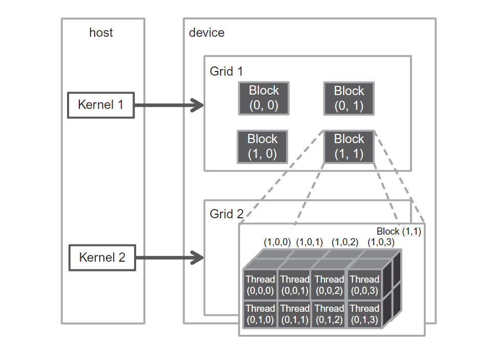
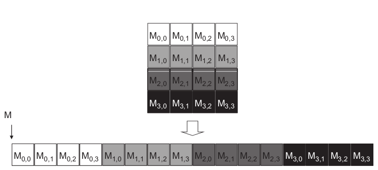
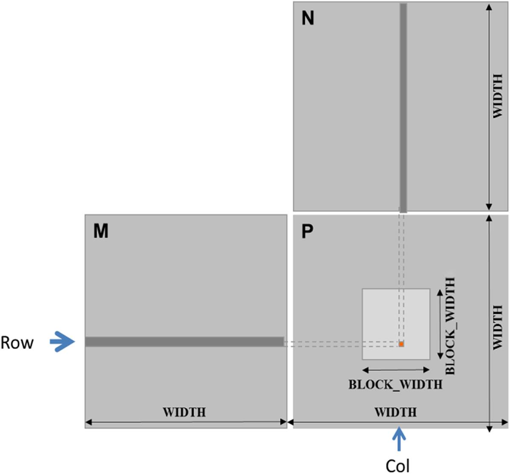

# 3. Scalable Parallel Execution

[TOC]

---

## 3.1 Multidimensional Grid Organization
The execution configuration parameters in a kernel launch statement

```C
function_name<<<gridDim, blockDim>>>(...);
                    ^       ^
```
- Both parameters are of the dim3 type, which is a C struct with three unsigned integer fields: x, y and z.

- The programmer can use fewer than three dimensions by setting the size of the unused dimensions to 1.

- For convenience, CUDA C allows the programmer to launch a kernel with one-dimensional grids and blocks. The rest two dimensions will be set to 1.

- In CUDA C the allowed values of gridDim.x range from 1 to 2^31 − 1,1 and those of gridDim.y and gridDim.z range from 1 to 2^16 − 1 (65,535).

- The total size of a block is limited to 1024 threads. For instance, blockDim(512, 1, 1), blockDim(8, 16, 4) and blockDim(32, 16, 2) are allowable blockDim values, but blockDim(32, 32, 2) is not because the total number of threads exceed 1024.

- Note that the ordering of the block and thread labels is such that **highest dimension comes first**. This notation uses an ordering that is the reverse of that used in the C statements for setting configuration parameters, in which the lowest dimension comes first.

A CUDA grid organization:

```C
dim3 dimGrid(2, 2, 1);
dim3 dimBlock(4, 2, 2);
KernelFunction<<<dimGrid, dimBlock>>>(…);
```



---

## 3.2 Mapping Threads to Multidimensional Data
The ANSI C standard requires that the number of columns in 2D array be known at compile time to be accessed as a 2D array. Unfortunately, this information is not known at compiler time for dynamically allocated arrays. Consequently, programmers need to explicitly linearize or “flatten” a dynamically allocated two-dimensional array into an equivalent one-dimensional array in the current CUDA C.

A way to linearize a two-dimensional array is place all elements of the same row into consecutive locations as shown below.



2D array:
- index:
```C
int col = blockIdx.x * blockDim.x + threadIdx.x;
int row = blockIdx.y * blockDim.y + threadIdx.y;
```
- linearized access: $P[row*width+col]$

3D array:
- index:
```C
int col = blockIdx.x * blockDim.x + threadIdx.x;
int row = blockIdx.y * blockDim.y + threadIdx.y;
int plane = blockIdx.z * blockDim.z + threadIdx.z;
```
- linearized access: $P[plane*width*height+row*width+col]$

## 3.3 Example of Color to Greyscale
([full code](./labs/image_color_to_grayscale)).
```C
// we have 3 channels corresponding to RGB
// The input image is encoded as unsigned characters [0, 255]
__global__
void colorToGreyscaleConversion(unsigned char * Pout, 
                                unsigned char * Pin,
                                int width, int height) 
{
    int Col = threadIdx.x + blockIdx.x * blockDim.x;
    int Row = threadIdx.y + blockIdx.y * blockDim.y;
    if (Col < width && Row < height) {

        // get 1D coordinate for the grayscale image
        int greyOffset = Row * width + Col;

        // one can think of the RGB image having
        // CHANNEL times columns than the grayscale image
        int rgbOffset = greyOffset * CHANNELS;
        unsigned char r = Pin[rgbOffset + 0]; // red value for pixel
        unsigned char g = Pin[rgbOffset + 1]; // green value for pixel
        unsigned char b = Pin[rgbOffset + 2]; // blue value for pixel
        
        // perform the rescaling and store it
        // We multiply by floating point constants
        Pout[grayOffset] = 0.21f*r + 0.71f*g + 0.07f*b;
    }
}
```

---

## 3.4 Example of Image Blur
Mathematically, an image blurring function calculates the value of an output image pixel as a weighted sum of a patch of pixels encompassing the pixel in the input image([full code](./labs/image_blur)).
```C
__global__
void blurKernel(unsigned char *in, unsigned char *out, int width, int height)
{
    int Col = threadIdx.x + blockIdx.x * blockDim.x;
    int Row = threadIdx.y + blockIdx.y * blockDim.y;
    if (Col < width && Row < height) {
        
        int pixVal = 0;
        int pixels = 0;

        // Get the average of the surrounding BLUR_SIZE x BLUR_SIZE box
        for (int blurRow = -BLUR_SIZE; blurRow < BLUR_SIZE + 1; blurRow++) {
            for (int blurCol = -BLUR_SIZE; blurCol < BLUR_SIZE + 1; blurCol++) {
                int curRow = Row + blurRow;
                int curCol = Col + blurCol;
                
                // If the pixel is within the image, add its value to the sum
                if(curRow >= 0 && curRow < height && curCol >= 0 && curCol < width) {
                    pixVal += in[curRow*width + curCol];
                    pixels++; // Keep track of the number of pixels in the avg
                }
            }
        }
        // Write our new pixel value out
        out[Row*width + Col] = (unsigned char)(pixVal / pixels);
    }
}
```

---

## 3.5 Example of Matrix Multiplication
Matrix-matrix multiplication, or matrix multiplication in short, is an important component of the Basic Linear Algebra Subprograms standard (BLAS). There are three levels of linear algebra functions

Level 1 functions perform vector operations of the form $y=αx+y$, where x and y are vectors and α is a scalar. Our vector addition example is a special case of a level 1 function with α=1.

Level 2 functions perform matrix-vector operations of the form $y=αAx+βy$, where A is a matrix, x and y are vectors, and α and β are scalars. We will be studying a form of level 2 function in sparse linear algebra.

Level 3 functions perform matrix-matrix operations in the form of $C=αAB+βC$, where A, B, and C are matrices and α and β are scalars.



To implement thread-to-data mapping, we can effectively divides P into tiles, one of which is shown as a light-colored square in the following image Each block is responsible for calculating one of these tiles.

```C
__global__ void MatrixMulKernel(float* M, float* N,
                                float* P, int Width) {
    int row = blockIdx.y * blockDim.y + threadIdx.y;
    int col = blockIdx.x * blockDim.x + threadIdx.x;
    if (row < Width && col < Width) {
        float PValue = 0;
        for (int k = 0; k < Width; ++k) {
            Pvalue += M[row*Width+k] * N[k*Width+col];
        }
        P[row*Width+col] = PValue;
    }
}
```

---
